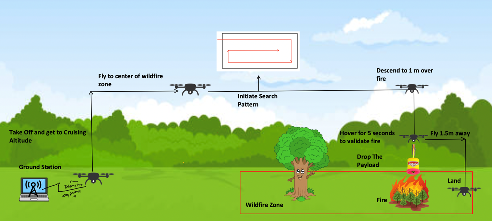
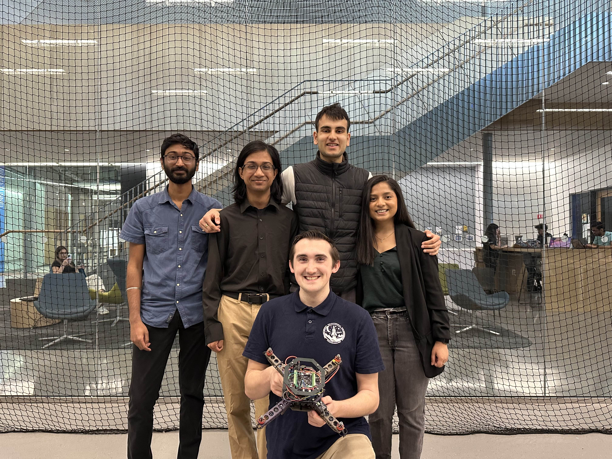
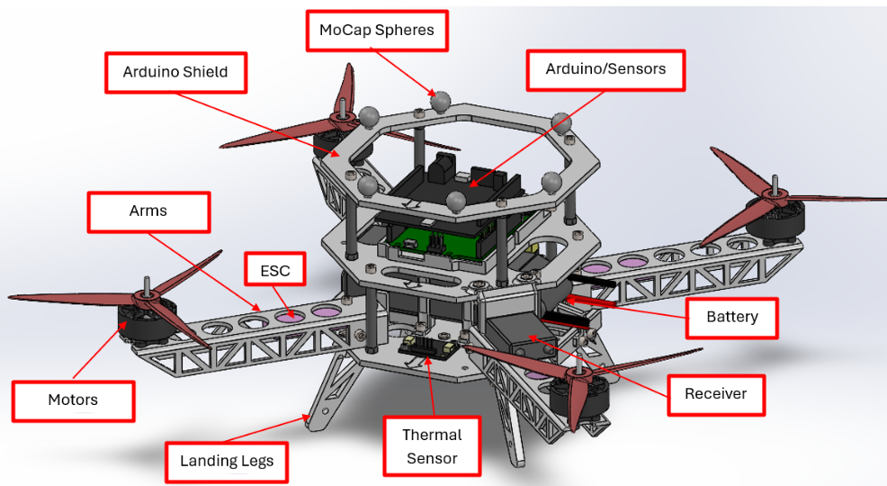
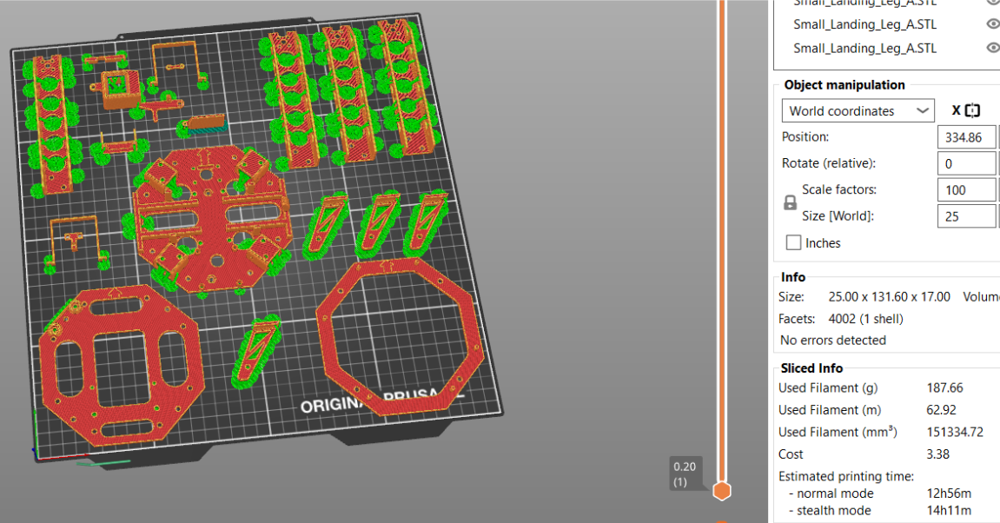
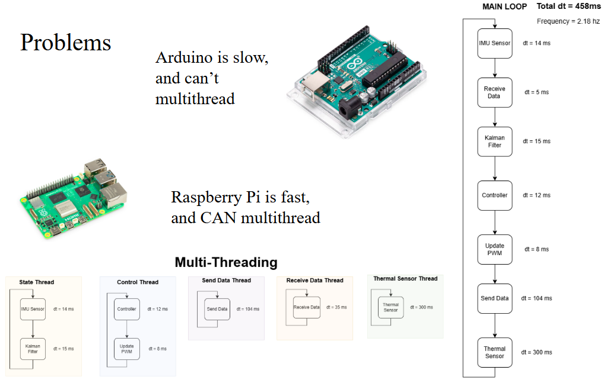
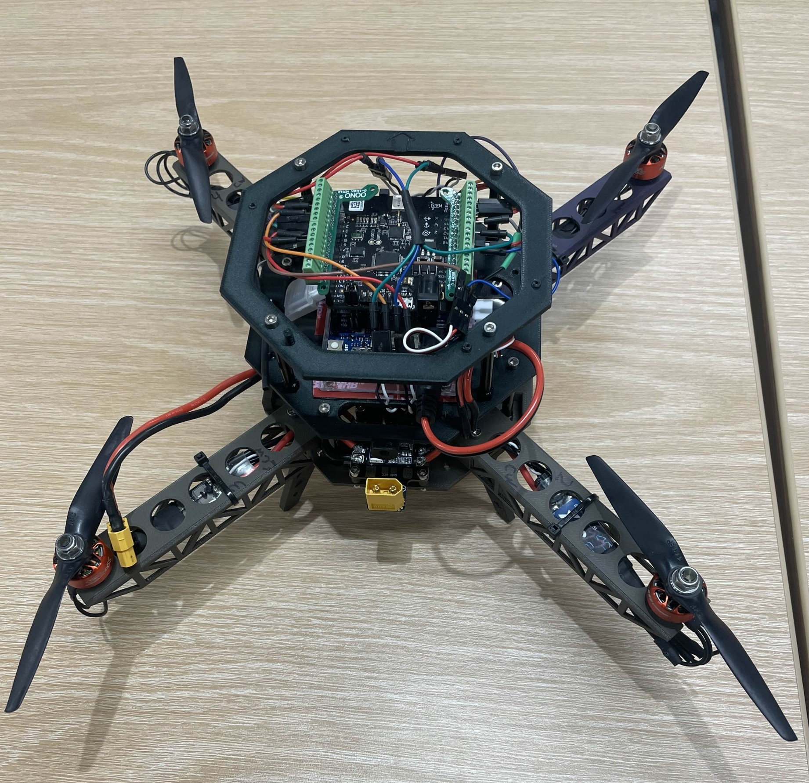

# 🔥 Autonomous Fire Fighting Drone

## A functional, affordable, and easily buildable drone capable of searching an area, detecting a heat source, and deploying a payload.  
🏆 **First Place Winner – Senior Capstone Showcase**

This senior capstone project’s objective was to design and build a drone capable of autonomously searching a designated area, locating a simulated fire using a thermal camera, and deploying a fire suppressant. Teams were given only the following components: an **Arduino**, a **thermal camera**, a **transmitter/receiver**, and an **IMU**.

> 👨‍🚒 **Team Name:** *The FireFlighters*

---

## 📸 Team Photo

**Team Members (left to right):**

- **Achutan Srinivasan** – Back Left  
- **Ankur Ghorai** – Back Middle Left  
- **Jaisel Singh** – Back Middle Right  
- **Trusha Patel** – Back Right  
- **Mark Yazemboski** (👋 Me, Front) – *Team Lead*

---

## 🛠️ Key Design Principles

We focused on four core physical design goals:

- ✅ Fully 3D-printed frame  
- 🛒 Easily obtainable parts (Amazon, GetFPV, etc.)  
- 🧩 Modular, repairable design  
- ⚡ Clean and efficient wire management  

---

## 💡 Design Rationale

After studying past teams, we identified key ways to improve:

- **3D-printed frame** for rapid repair and low cost  
- **Fast-shipping parts** to avoid long lead times  
- **Modular design** allowed broken parts (like arms) to be replaced in hours  
- **Wire routing** designed into the frame to prevent tangles and shorts  

---

## 🧠 Drone Architecture (CAD Model)

A three-tier frame layout:

1. **Base Plate**  
   - Mounts arms, battery, PDB, payload, and ESCs  
   - Central structure for mechanical and electrical subsystems  

2. **Top Plate**  
   - Mounts the Arduino and IMU  
   - Raised to reduce EMI from high-current motor lines  

3. **Shield**  
   - Holds MoCap markers for position tracking  
   - Protects sensitive electronics during crashes  

---

## ✈️ Arm Design

The custom arm design used a **C-beam profile with trusses**:

- **C-channel** let us route ESCs and wires inside the arm  
- **Trusses** reduced weight while maintaining strength  
- These features improved stiffness and flight stability despite the printed frame  

---

## 🖨️ 3D Printing & Cost Efficiency

- Printed using **PLA on a Prusa XL**  
- **Total print time:** ~13 hours  
- **Material cost:** ~$3.38  
- Demonstrated that UAVs can be affordable and manufacturable quickly  

---

## 📂 Repository Contents

- **Drone CAD/** – All SolidWorks models with accurate weight/inertia  
- **STL_and_Prusa_Files/** – Printable files for all drone parts + pre-arranged Prusa slicer project  
- **Build_Book.pdf** – Step-by-step construction and setup guide  
- **FireFlighters_Drone_BOM.xlsx** – Full bill of materials with costs and part links  
- **ManualFlightCode/** – Arduino code for manual RC flight  
- **HandCarryCode/** – Contains full autonomy logic (not flight-ready)  
- **Matlab_Kalman_Filter_Prototype.m** – MATLAB simulation of the onboard Kalman Filter  
- **Thermal_Sensor_Simulation.py** – Python simulation of the thermal camera behavior  
- **Final_Report.pdf** – Technical report covering the full design, testing, and conclusions  

---

## 🧪 Issues Encountered

The **Arduino Uno**, while functional, lacks the processing power and **multithreading capabilities** needed for real-time autonomous flight. Specifically:

- The **GCS communication protocol** took ~100 ms per loop iteration  
- This limited the control loop to ~2 Hz (instead of the desired 100+ Hz)  
- The drone couldn't stabilize itself while processing communication, sensor input, and control logic all on the same thread  

As a workaround, the drone was hand-carried during the demo to showcase data transmission, Kalman filter-based orientation and position estimation, waypoint tracking, search pattern execution, thermal detection, and payload deployment.

### 🔧 Future Recommendation

Next year's team will upgrade to a **Raspberry Pi**, which supports:

- Multithreading (e.g., separate threads for GCS comms and control loop)  
- Faster processing for real-time autonomy  
- More flexible development in Python or C++  

---

## 🧾 Conclusion

This capstone project was an incredible learning experience. Building a product from the ground up taught me far more than I expected—not just about **CAD** and designing components for manufacturability and ease of assembly, but also about algorithms and core topics in **autonomy**.

I deepened my understanding of **Kalman filters** (my personal favorite), learned how to implement **cascade PID controllers**, developed **waypoint navigation**, and wrote the full autonomy codebase. This project challenged and refined my programming skills and solidified my passion for **Guidance, Navigation, and Control (GNC)** and **autonomous systems**.

Thank you!

## 📄 Final Report

For complete technical details on design, components, control logic, testing, and results, see the [**Final Report**](Final_Report.pdf).
